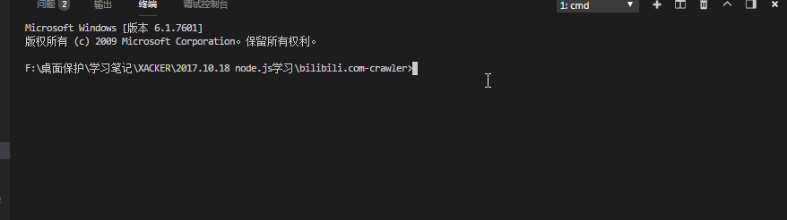

# bilibili.com crawler

# 效果图预览

# 用法 Usage

1.由于b站有反爬虫机制，视频地址依赖浏览器获取，因此要求首先安装Chrome浏览器（版本号 66.0.0 及以上，低于此版本无法通过node.js驱动）。

2.安装node.js，并将node.js.exe的路径设置为path：

    > 具体方法：
    1.百度node，或输入网址:nodejs.cn，下载对应版本并安装
    2.打开控制台（终端），windows系统快捷键 win+r->输入cmd-> 回车，输入 node ,并回车。
    3.如果输出node命令没有找到，请跳转到第4步；输出其他跳转到第6步
    4.找到第1步node的安装位置,目录下要有node.exe：例如我的地址：E:\nodejs\node.exe
    5.右键我的电脑->属性->高级系统设置->高级->环境变量->系统变量->变量Path0>编辑->最前面加上第4步中的位置的父目录，注意末尾要加一个分号，比如："E:\node.j;"
    6.此步开始，你已经能通过控制台（终端）正常使用node

3.下载本代码,例如位于 E:\bilibili.com-crawler

4.打开控制台:通过两个命令 cd（打开文件夹) 和 cd..（回到上级文件夹）,切换到 E:\bilibili.com-crawler

5.执行命令 npm install ：此命令是安装依赖包，由于依赖包很多，上传很慢，因此node可以像这样根据配置跨系统安装。如果安装很慢，请百度cnpm，这是淘宝的npm镜像源，你访问淘宝有多快，那这也会这么快

6.通过编辑软件，推荐vscode、notepad、记事本。打开一级目录下文件 comfig.json。填写你要抓的视频地址

>chrome指第1步的chrome浏览器地址

>ep指b站每部动漫都有ep，例如https://www.bilibili.com/bangumi/play/ep85156，注意有时通过其他页面进入到动漫的页面，会显示为https://www.bilibili.com/bangumi/play/ss822，这样的话在动漫页面换一下集数，再换回来就是ep了

>headless指是否开启后台模式，如果修改为true，那么获取视频的时候回前台打开浏览器，你可以开启来观察抓包的原理

7.配置完成后，控制台切换到与第5步一样的目录，输入npm run crawl

# 原理分析

todo

 
 
 
 
 
 
 
 
 
 
 
 
 
 
 
 
 
 
 
 
 
 
 

# 如果你也想写一个自己的爬虫,以下是我在写的时候遇到的问题,可以供你参考

*注意事项：

1.putteteer 的 mousemove 是相对 setview 后的位置来定位的。但是我们通常会在普通浏览器下来寻找元素的坐标。而普通浏览器的 view大小通常并不是你屏幕的分辨率大小 ，具体可以打开开发者工具查看。 

解决方案： 用普通浏览器的全屏模式来寻找坐标。或setview为普通浏览器的窗口大小